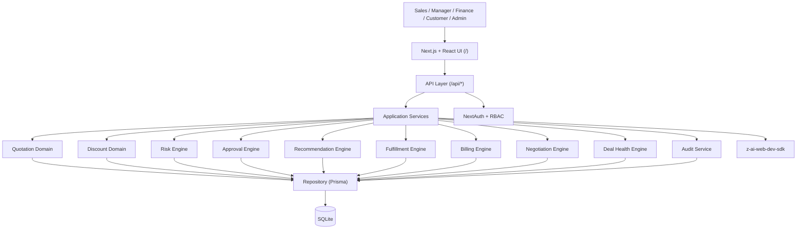

# Architecture

## Layered Architecture

```
┌─────────────────────────────────────────────────────────────────┐
│  Presentation (Next.js / React / shadcn-ui / Tailwind)           │
│  - Single `/` route, client-side view navigation                │
│  - Read-only display of business facts                          │
└─────────────────────────────────────────────────────────────────┘
                            ↓
┌─────────────────────────────────────────────────────────────────┐
│  API Layer (Next.js Route Handlers under /api/*)                │
│  - Zod request validation                                        │
│  - Session/role authorization                                    │
│  - Delegates to application services                            │
└─────────────────────────────────────────────────────────────────┘
                            ↓
┌─────────────────────────────────────────────────────────────────┐
│  Application Services                                            │
│  QuotationService · ApprovalService · FulfillmentService        │
│  BillingService · NegotiationService · AuditService              │
│  - Orchestrate domain engines + repositories                     │
│  - Transactional                                                │
└─────────────────────────────────────────────────────────────────┘
                            ↓
┌─────────────────────────────────────────────────────────────────┐
│  Domain Engines (pure, deterministic, testable)                  │
│  RiskEngine · DiscountPolicyResolver · ApprovalPolicyResolver   │
│  FulfillmentOptimizer · BillingCalculator · DealHealthEngine    │
│  RecommendationScorer · ProrationCalculator                      │
└─────────────────────────────────────────────────────────────────┘
                            ↓
┌─────────────────────────────────────────────────────────────────┐
│  Repository (Prisma Client)                                      │
│  - Single `db` instance, connection-pooled in dev               │
└─────────────────────────────────────────────────────────────────┘
                            ↓
┌─────────────────────────────────────────────────────────────────┐
│  SQLite (file: ./db/custom.db)                                  │
└─────────────────────────────────────────────────────────────────┘
```

## Rules

1. **UI is not business logic.** React may display results but never compute authoritative values.
2. **Database is source of truth.** No static business data arrays in code.
3. **AI is not authoritative.** AI may summarize/explain; it never decides discounts, risk, approvals, allocations, invoice totals, or payment totals.

## Determinism

Quote calculation, discount evaluation, risk score, approval routing, recommendation ranking, warehouse allocation, invoice calculation, proration and deal-health rules are all deterministic. Identical inputs always produce identical outputs.

## Money

All monetary values are stored as **integer cents** in SQLite (`Int`). Decimal representation is reconstructed only at the presentation boundary via the `formatCurrency` / `toDecimal` helpers in `src/lib/money.ts`.

## Single-Page App Constraint

Per environment rules, only the `/` route is user-visible. The whole DealFlow360 UI therefore lives on `/` with client-side view switching driven by a Zustand `useViewStore`. The sidebar updates `activeView`; the main panel renders the matching feature component. All data mutations go through `/api/*` routes which call the application services.

## Diagram


